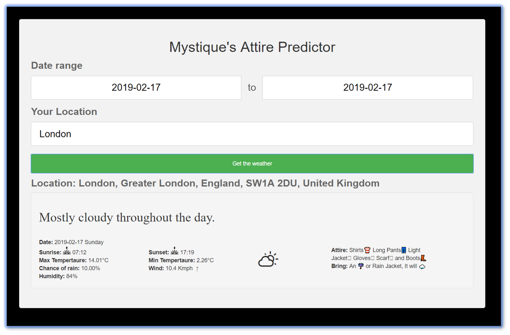

# AWS Fargate Weather Prediction App

Lets predict the attire to wear based on the weather for a given location

1. ## Prerequisites

    This demo, instructions, scripts and cloudformation template is designed to be run in `us-east-1`. With few modifications you can try it out in other regions as well(_Not covered here_).

    - AWS CLI pre-configured - [Get help here](https://youtu.be/TPyyfmQte0U)
    - Get DarkSky API Key
        - Get your own [DarkSkey API Key](https://darksky.net/dev)

1. ## Setting up the environment

    - Get the application code

        ```bash
        git clone https://github.com/miztiik/predict-attire-for-weather-using-fargate.git
        cd predict-attire-for-weather-using-fargate
        ```

    - Update your API key

        In the file `src/config/prod_config.json` update your `api key`

1. ## Deployment

    You have couple of options to set this up in your account, You can use [AWS CDK](https://www.youtube.com/watch?v=MKwxpszw0Rc) or use the cloudformation template generated by CDK. All the necessary steps are baked into the templates, you can launch it and try it out.

1. ### Method 1: Using AWS CDK

    If you have AWS CDK installed you can close this repository and deploy the stack with,

    ```bash
    # If you DONT have cdk installed
    npm install -g aws-cdk

    # Make sure you in root directory
    cd predict-attire-for-weather-using-fargate
    source .env/bin/activate
    pip install -r requirements.txt
    ```

    The very first time you deploy an AWS CDK app into an environment _(account/region)_, you’ll need to install a `bootstrap stack`, Otherwise just go aheadand   deploy using `cdk deploy`

    ```bash
    cdk bootstrap
    cdk deploy *
    ```

1. ## Testing the solution

    The `cdk deploy` command should provide you the application load balancer url to access the web app. _You can get the same from cloudformation outputs or in the ALB page.

    Access the linux server IP/Docker Host IP in your browser, you should be seeing something like this,
    

1. ## CleanUp

    If you want to destroy all the resources created by the stack, Execute the below command to delete the stack, or _you can delete the stack from console as well_

    ```bash
    cdk destroy *
    ```

    This is not an exhaustive list, please carry out other necessary steps as maybe applicable to your needs.

## Buy me a coffee

Buy me a coffee ☕ through [Paypal](https://paypal.me/valaxy), _or_ You can reach out to get more details through [here](https://youtube.com/c/valaxytechnologies/about).

### References

1. [Source Repo](https://github.com/miztiik/predict-attire-for-weather)

1. [Docker Hub](https://hub.docker.com/r/mystique/predict-attire-for-weather)

### Metadata

**Level**: 200
